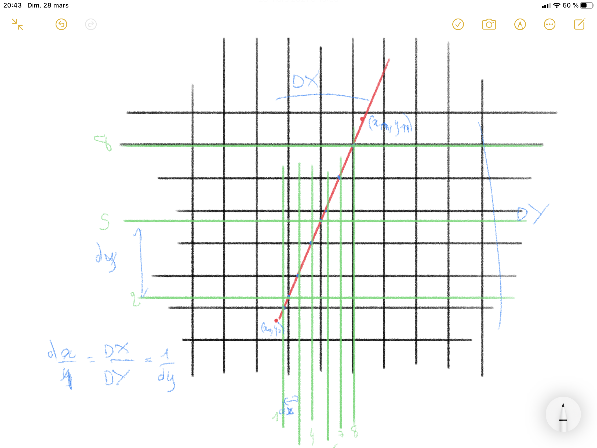

# Day 10: Raycasting viewer

For today I wanted to change subject and I found this [raycasting un 256 lines of js](https://www.playfuljs.com/a-first-person-engine-in-265-lines/). And I wanted to give a shot. It's the algorithme behind old 3D game shooter like doom or wolfeinstein 3D.

Unfortunatly the code is unreadable if you don't know the maths behind and the article does not go to much into detail. 

So I only had time to write the view function which takes a list of casted ray. And display Them. 

To be simple, you cast a ray for each vertical line of your view. Then you will check what wall it intersect and compute the distance from the camera. Which will result into something like this :

```
##                                               ##
####                                           ####
######                                        #####
##########                               ##########
###################################################
###################################################
###################################################
###################################################
###################################################
###################################################
###################################################
###################################################
####                                           ####
##                                               ##
```
Here you are facing a wall and you also see the wall on your left and right.

Later we will add color or texture for a better view. 

Know I am trying to figure the maths behind. 

## The maths behind

There is two way of approching this probleme. The first if pretty obvious. You cast your ray and move allong the ray with tiny step. A tiny step in regarde of the size of your grid with. At each step you check your grid to see if you have encounter a wall. If not you continue to follw your ray until you have gone to far. 

But you will have to check to much your grid and this is not effecive. 

Since your object cannot be smaller than our grid width we can only check at the grid intersection with the ray. To compute the intersection, you have to separate horizontal and verical intersection.  

I found [this ressource](http://projet-moteur-3d.e-monsite.com/pages/raycasting/raycasting.html) sadly only in french. 




